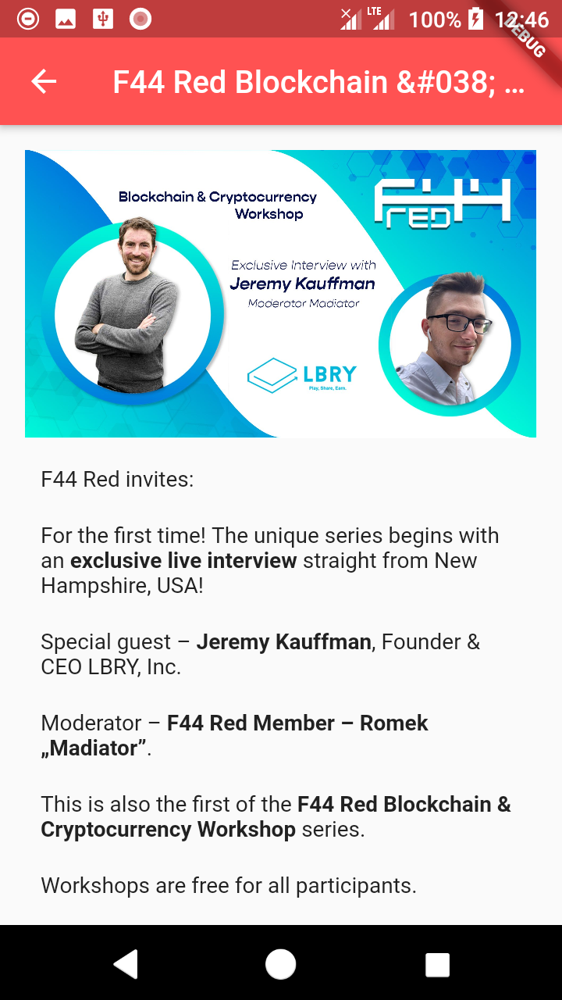

# F44Red Flutter

## What's new?

Improved appearance and added post details.

## About project

This is second version of F44Red mobile app made with Flutter framework this time. Previous version was made with Android Studio 

Working app below:

## Technologies used in the project

* Dart/Flutter

## Goals

Main goal is fix issue with displaying images behind header and of course try new technolgies which were Dart/Flutter framework.

## License

My project is under BSD-2-Clause license. You can use some parts from my code but remember to credit me as an appreciation to my work! Thanks! Awoo!

© 2022 Paweł "Wilczeq/Vlk" Turoń
